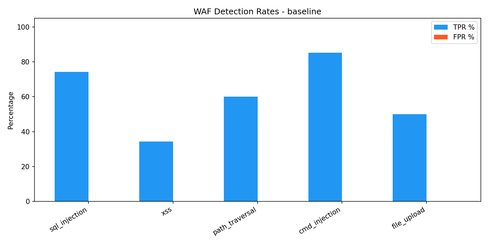
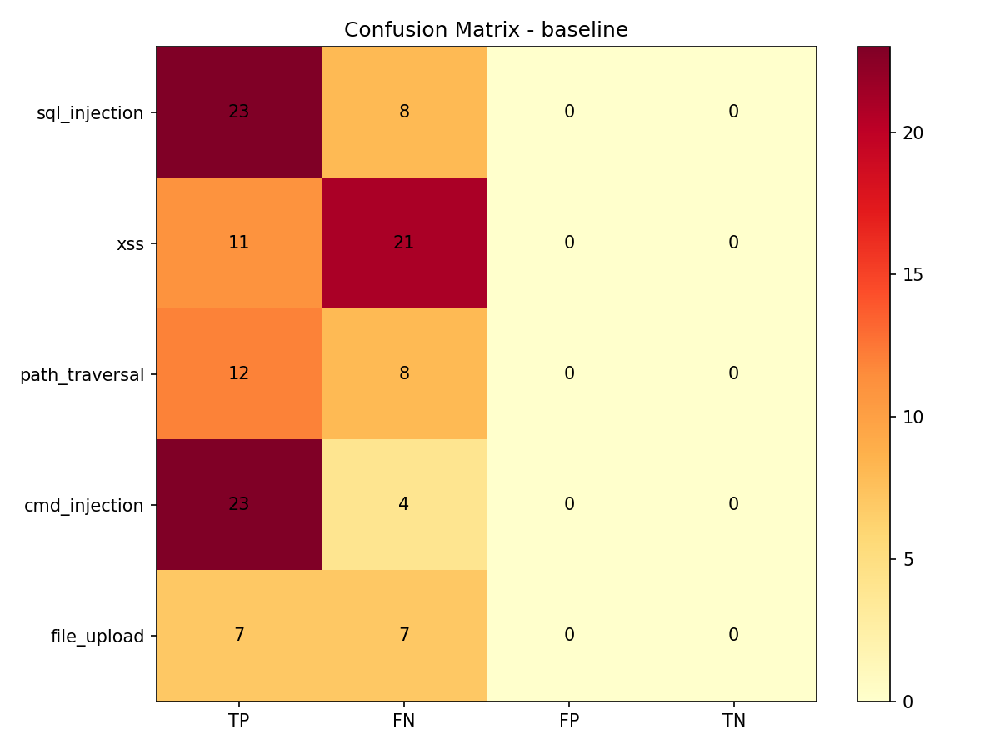

# WAF Evaluation Report - baseline - 2026-05-28

## Summary

| Category | TP | FN | FP | TN | TPR | FPR | F1 |
|----------|----|----|----|----|-----|-----|----|
| sql_injection | 23 | 8 | 0 | 0 | 74.2% | 0.0% | 0.852 |
| xss | 11 | 21 | 0 | 0 | 34.4% | 0.0% | 0.512 |
| path_traversal | 12 | 8 | 0 | 0 | 60.0% | 0.0% | 0.750 |
| cmd_injection | 23 | 4 | 0 | 0 | 85.2% | 0.0% | 0.920 |
| file_upload | 7 | 7 | 0 | 0 | 50.0% | 0.0% | 0.667 |
| benign | 0 | 0 | 10 | 22 | 0.0% | 31.2% | 0.000 |

## Failed Payloads (FN - bypassed WAF)

- `cmd-013` (cmd_injection, status=302)
- `cmd-015` (cmd_injection, status=500)
- `cmd-024` (cmd_injection, status=500)
- `cmd-025` (cmd_injection, status=500)
- `upload-001` (file_upload, status=302)
- `upload-002` (file_upload, status=302)
- `upload-003` (file_upload, status=302)
- `upload-004` (file_upload, status=302)
- `upload-011` (file_upload, status=302)
- `upload-012` (file_upload, status=302)
- `upload-014` (file_upload, status=302)
- `pt-005` (path_traversal, status=404)
- `pt-006` (path_traversal, status=404)
- `pt-007` (path_traversal, status=404)
- `pt-008` (path_traversal, status=404)
- `pt-011` (path_traversal, status=404)
- `pt-012` (path_traversal, status=200)
- `pt-019` (path_traversal, status=404)
- `pt-020` (path_traversal, status=404)
- `sqli-006` (sql_injection, status=200)
- `sqli-007` (sql_injection, status=200)
- `sqli-008` (sql_injection, status=200)
- `sqli-009` (sql_injection, status=200)
- `sqli-010` (sql_injection, status=200)
- `sqli-012` (sql_injection, status=200)
- `sqli-014` (sql_injection, status=200)
- `sqli-017` (sql_injection, status=500)
- `xss-001` (xss, status=200)
- `xss-002` (xss, status=200)
- `xss-003` (xss, status=200)
- `xss-004` (xss, status=200)
- `xss-005` (xss, status=200)
- `xss-006` (xss, status=200)
- `xss-007` (xss, status=200)
- `xss-009` (xss, status=200)
- `xss-010` (xss, status=200)
- `xss-013` (xss, status=200)
- `xss-015` (xss, status=200)
- `xss-016` (xss, status=200)
- `xss-019` (xss, status=200)
- `xss-023` (xss, status=200)
- `xss-024` (xss, status=200)
- `xss-025` (xss, status=200)
- `xss-026` (xss, status=200)
- `xss-027` (xss, status=200)
- `xss-028` (xss, status=200)
- `xss-031` (xss, status=200)
- `xss-032` (xss, status=200)

## False Positives (FP - benign blocked)

- `benign-003` (benign, status=403)
- `benign-004` (benign, status=403)
- `benign-005` (benign, status=403)
- `benign-006` (benign, status=403)
- `benign-007` (benign, status=403)
- `benign-008` (benign, status=403)
- `benign-009` (benign, status=403)
- `benign-023` (benign, status=403)
- `benign-024` (benign, status=403)
- `benign-026` (benign, status=403)

## Charts

## 基线弱点分析（用于 Phase 4 加固）

### SQLi 绕过类型
- `sqli-006` Unicode 全角字符（ＳＥＬＥＣＴ）→ 需 NFKC 归一化
- `sqli-007/008` CHAR()/十六进制 → 需新增规则
- `sqli-009/010` `||`/CONCAT 拼接 → 需新增规则
- `sqli-012` 布尔盲注 SUBSTRING → 函数检测
- `sqli-014` 反引号包裹 → 需新增规则

### XSS 绕过类型（最严重，TPR 仅 34%）
- `xss-001/002` 标签变体 + src 属性
- `xss-003/004` 大小写（SCRIPT 但小写脚本被拦）
- `xss-005/006/007/009/010` 标签内换行/制表符注入事件
- `xss-013/015` javascript: 协议 HTML 实体编码
- `xss-016/019` Data URI / mXSS noscript
- `xss-023-028` 各种事件处理器（onload, ontoggle, onstart, body）
- `xss-031/032` DOM clobbering

### 路径穿越绕过
- `pt-005/006` 双重 URL 编码 `..%252f` → 需多轮解码 + 新规则
- `pt-007/008` 畸形 UTF-8 `..%c0%af` → 需新规则
- `pt-019/020` Overlong UTF-8 `%ef%bc%8f`

### 命令注入绕过
- `cmd-013/015/024/025` IFS/process-substitution → 需新规则

### 文件上传绕过
- `upload-001-014` 多数返回 302（请求未达后端） → WAF 完全未拦截，需 magic bytes 校验

### 误报（FPR 31.2% 偏高）
- `benign-003 to benign-009`：自然语言中包含 SQL 关键字（"select a date"、"drop me a line"）
- `benign-023/024/026`：`O'Brien` 等含撇号的合法名字

加固方向：
1. 增加归一化（NFKC、多轮解码、注释剥离）
2. 扩展 SQL/XSS/path/cmd 规则
3. 新增 magic bytes 校验
4. 收紧 SQL 关键字匹配，减少自然语言误报（可能需要要求关键字前后有特殊字符 context）
